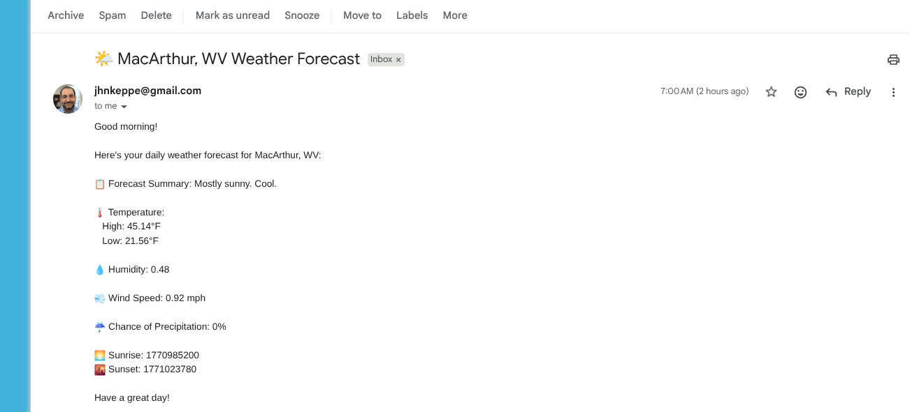

# 🌤️ Zapier Automated Daily Weather Email

A simple automation that fetches the daily weather forecast and delivers it to your inbox every morning. Built as a hands‑on learning project to practice low‑code automation, structured data handling, and clean documentation.

This project demonstrates how to connect APIs, format data, and automate routine reporting using Zapier. It also shows how I use AI tools like Copilot to refine documentation and improve clarity.

This project is for personal learning and experimentation. Feel free to reference the structure for your own projects.

## 📬 Example Daily Weather Email
To show what the automation produces in a real inbox, here’s an actual screenshot of the daily weather forecast email generated by the Zap:



This example highlights the final output after the data is fetched, formatted, and delivered automatically each morning.

## ⚙️ Setup Instructions

Follow these steps to recreate or customize this daily weather automation in your own Zapier account.

### 1. Create a New Zap
- Log in to Zapier
- Click **Create Zap**
- Name it something like “Daily Weather Email”

### 2. Add the Trigger: Schedule by Zapier
- Choose **Schedule by Zapier**
- Set it to run **Every Day**
- Choose the time you want the email delivered

### 3. Add Action: Webhooks by Zapier (GET)
- Choose **Webhooks by Zapier**
- Select **GET**
- Enter your weather API endpoint  
  (For example: a public weather API URL with your city and API key)
- Test the step to confirm Zapier receives weather data

### 4. Add Action: Formatter by Zapier (Text)
- Choose **Formatter → Text**
- Select **Extract / Transform / Format**
- Clean up the API response into a readable message  
  (e.g., temperature, conditions, highs/lows)

### 5. Add Action: Gmail – Send Email
- Choose **Gmail**
- Select **Send Email**
- Set the **To** field to your own email address
- Add a subject like: “Your Daily Weather Forecast”
- Insert the formatted text from the previous step into the email body

### 6. Test the Zap
- Run a test to make sure the email arrives correctly
- Adjust formatting if needed

### 7. Turn the Zap On
- Once everything looks good, turn the Zap on
- You’ll now receive an automated weather email every morning

## 🔄 Automation Flow Diagram

Below is a simple visual overview of how the Zap processes and delivers the daily weather email:
```
[Schedule Trigger – Every Morning]
↓
[Webhook GET Request – Fetch Weather Data]
↓
[Formatter – Clean & Structure Text]
↓
[Gmail – Send Daily Weather Email]
```

## ⚙️ How the Automation Works

### Trigger
- Schedule by Zapier  
Runs once every morning at a set time.

### Actions
1. Webhooks by Zapier – GET request  
Retrieves the current weather forecast from a public API.

2. Formatter by Zapier – Text  
Cleans and structures the API response into a readable format.

3. Gmail – Send Email  
Sends the formatted forecast to my inbox as a daily report.

## Why This Matters
This workflow removes manual checking, ensures consistency, and demonstrates how automation can support everyday routines with minimal maintenance.

## 📁 Repository Structure
```
zapier-weather-automation/
│
├── README.md
├── sample-output/
  └── weather-email-screenshot.png
```
  
## 🧠 What I Learned
- How to structure a multi‑step Zap using scheduling, webhooks, and formatting tools
- How to clean and transform API responses into readable output
- How to document small automation projects clearly and professionally
- How to use AI tools like Copilot to refine writing and improve clarity
- How to present automation work in a way that’s accessible to recruiters and hiring managers

## 🚀 Future Improvements
- Add a second version that includes a 3‑day or 7‑day forecast
- Store weather data in a spreadsheet for trend tracking
- Add conditional logic (e.g., send alerts for severe weather)
- Build a Notion or Slack version of the daily report

## 📝 Acknowledgments
This README was written and refined with the help of Microsoft Copilot, which assisted in organizing the structure, improving clarity, and polishing the documentation.
